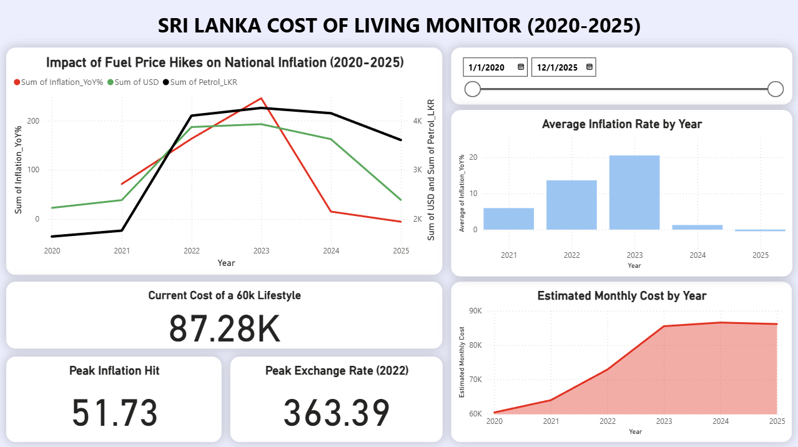

# Sri Lanka Cost of Living Analysis

## 📌 Project Overview
This project analyzes the trend of the **cost of living in Sri Lanka** over recent years using officially published economic indicators. The objective is to understand how changes in **inflation, fuel prices, and exchange rates** have impacted the overall cost of living and household affordability.

This is a **group-based data analysis project** focused on real-world data cleaning, trend analysis, and insight generation using analytical and visualization tools.

## 🎯 Objectives
* Analyze historical trends in Sri Lanka’s cost of living.
* Identify periods of significant inflationary pressure.
* Examine the relationship between fuel prices, exchange rates, and overall cost increases.
* Present insights through an interactive and user-friendly dashboard.

## 📊 Data Sources
The analysis is based on publicly available and credible data sources:
* **Consumer Price Index (CPI):** Department of Census & Statistics Sri Lanka
* **Fuel Price Data:** Publicly released price revisions (Ceylon Petroleum Corporation)
* **Exchange Rate Data (USD/LKR):** Central Bank of Sri Lanka

> **Note:** Category-wise CPI data (e.g., food vs. non-food) was not available for the full timeline; therefore, the analysis focuses on overall cost-of-living trends.

## 🛠 Tools & Technologies
* **Python:** Data cleaning, preprocessing, and exploratory analysis (Pandas, NumPy)
* **Power BI:** Interactive dashboard development & DAX measures
* **Excel:** Initial data validation and formatting
* **GitHub:** Version control and project documentation

## 🔍 Methodology
1.  **Data Collection:** Collected raw economic data from official government sources.
2.  **Data Cleaning:** Standardized datasets using Python (handling date formats, missing values, and unit normalization).
3.  **Trend Analysis:** Conducted time-series analysis on CPI, fuel prices, and exchange rates.
4.  **Correlation Check:** Examined relationships between currency depreciation and price hikes.
5.  **Visualization:** Built an interactive Power BI dashboard to narrate the data story.

## 📈 Key Insights
* The cost of living in Sri Lanka shows a sharp upward trend during major economic stress periods.
* Fuel price revisions closely align with spikes in inflation indicators.
* Exchange rate depreciation corresponds with increased pressure on overall living costs.
* Household affordability has significantly declined within short time intervals during peak inflation phases.

## 📊 Dashboard Features
* **Overall Trend:** Visualization of the Cost of Living Index over time.
* **Inflation Tracking:** Year-on-Year and Month-on-Month inflation movements.
* **Economic Drivers:** Direct comparisons between Fuel Prices and Exchange Rates.
* **Interactivity:** Time-based filtering (Slicers) for specific period analysis (e.g., Crisis Years vs. Post-Crisis).

## 👥 Project Team
This project was completed as a **group data analysis project**, with collaborative contributions across data collection, analysis, and visualization.

## 🚀 Outcome
The project demonstrates practical skills in:
* Working with real-world economic datasets.
* Data cleaning and trend-based analysis.
* Business-focused insight generation.
* Dashboard design and data storytelling.

## 📌 Future Improvements
* Incorporate category-wise CPI data when available.
* Expand analysis to regional cost-of-living comparisons.
* Add predictive modeling for future inflation trends.

## 📄 License
This project is intended for educational and portfolio purposes only.
